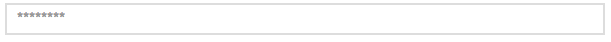

# tal-input-text

TAL Input Text Widget



# Install

```bash
bower install --save tal-input-script
```

# Use

## Initialising the widget
```js
require([
  'antie/widgets/component',
  'antie/widgets/componentcontainer',
  'bbcrd/widgets/input-text'
], function(Component, Container, InputText) {

  return Component.extend({
    init: function(){
        var app = this.getCurrentApplication();
        var container = new Container();

        var input = new InputText('', { placeholder: true, id: 'demo-input' });
        container.appendChildWidget(input);

        // ... render stuff
    }
  });
});
```

## Reacting to events

TBD.

# Testing

Simply run the tests using the following command.

```bash
npm test
```

If you add a feature and don't have any knowledge in testing, propose your code anyway. Explain what you want to achieve,
what are the edge cases and we'll do our best to fill the blanks.

# License

> Copyright 2014 British Broadcasting Corporation

> Licensed under the Apache License, Version 2.0 (the "License"); you may not use this file except in compliance with the License.
> You may obtain a copy of the License at

> http://www.apache.org/licenses/LICENSE-2.0

> Unless required by applicable law or agreed to in writing, software distributed under the License is distributed on an "AS IS" BASIS, WITHOUT WARRANTIES OR CONDITIONS OF ANY KIND, either express or implied.
> Se